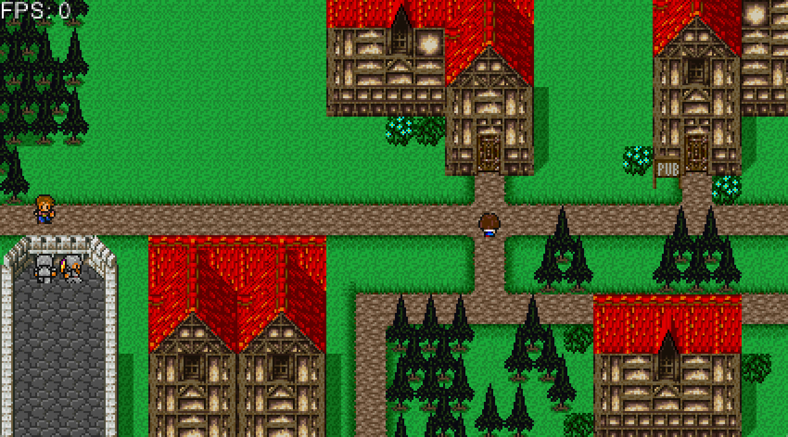

QuickRPG aka. "Die Dose"
========================

A role-playing game tech demo written in Ruby and Gosu circa 2013.
Actually a Ruby port of a game engine I made in 2003 in BlitzBasic.

Known Issues
------------

- Movement not implemented :)

Key Controls
------------

        [KEY]       [FUNCTION]
    (arrow keys)    Control the player
    space           Activate/trigger stuff in the world, make choices in text
                    dialogues
    esc             Quits the game
    d	            Show/hide debug information (grid, hotspot markers etc)
    f	            Show/hide frame rate

Graphics
--------

All resources were created in Oct 2001. I know I did the house tiles
by myself, looking at Final Fantasy VI a lot to imitate their patterns.
The walls were kind of copied from Final Fantasy V, the grass I don't
know anymore. Bushes, trees ugly sand, mushy paths and all character
sprites were my very own creation as far as I can remember.

The text box (at least its colors) was ripped from a QuickBASIC 4.5
RPG demo called "Untitled" by Tsugumo (= Jeff Hangartner, IIRC) and his
friend FrozenEmu. These two I owe a lot: Tsugumo and FrozenEmu answered
some dumb questions about scripting, file I/O, game logic and the like
waaaaaay back in 1999--2000 or so, when I still fought with QuickBASIC.

Visit <https://christiantietze.de/> for more links,
  downloads and infos on my projects and me.

LICENCE
=======

See `LICENSE.txt` in this repository.
